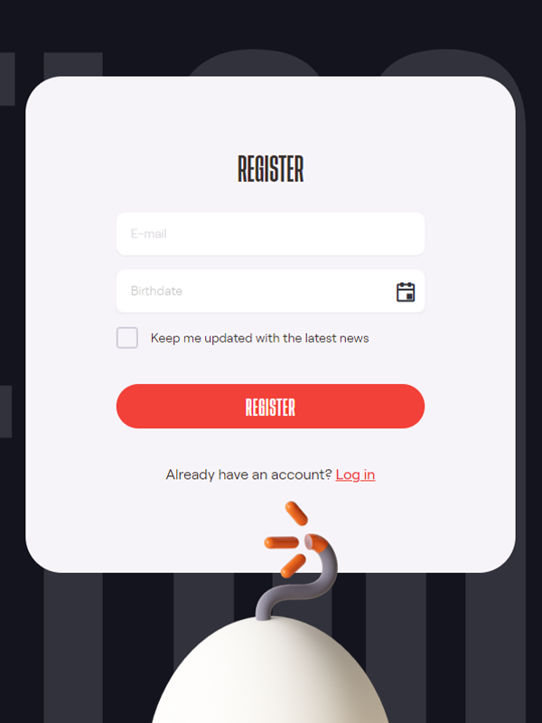

Creating an Account
=====

Our platform is designed in such a way that it doesn't matter if you're a brand, influencer, content creator or just an average Joe/Jane.
Anyone can register and everyone has the same functionalities at his/her disposal.
You can be a brand and an influencer with the same account, starting a campaign as a brand and at the same time create content for other brands just by flipping a switch.

Let me take you down the rabbithole and introduce you to our ever evolving platform.

It all starts with the....

.. _register:

Registration
------------

To be able to register for an account you'll need to be 16yrs or older.
This is due to strict privacy regulations in some parts of the world.

Just go to https://app.chirpley.ai/Account/Register in your browser of choice and fill in your emailadres and date of birth.
Before you hit the red Register-button you can choose to be updated on news and upcoming features by clicking the check-box.

Activation
----------------

After you've send the form, you'll receive a message in your email box. This includes a link to complete your registration.

.. image:: _static/images/activate.png
  :width: 400
  :align: center  
  :alt: Chirpley Activation

Follow the link and you'll be served with some questions to complete your registration.

   .. figure:: _static/images/register1.png
  :scale: 50%
  :align: center
    :alt: Complete registration 1

   .. figure:: _static/images/register2.png
  :width: 400
    :alt: Complete registration 2

At the moment of writing and for the purpose of the upcoming pre-sale and launch of our token, we've activated the Crypto market first.
We'll be activating more markets in the upcoming weeks.
