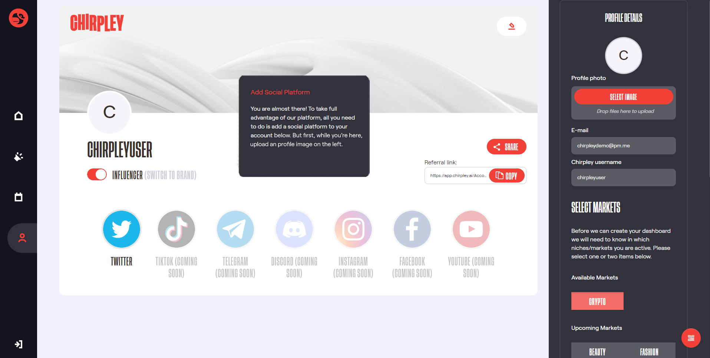

Creating an Account
=====

Our platform is designed in such a way that it doesn't matter if you're a brand, influencer, content creator or just an average Joe/Jane.
Anyone can register and everyone has the same functionalities at his/her disposal.
You can be a brand and an influencer with the same account, starting a campaign as a brand and at the same time create content for other brands just by flipping a switch.

Let me take you down the rabbithole and introduce you to our ever evolving platform.

It all starts with the....

Registration
------------

To be able to register for an account you'll need to be 16yrs or older.
This is due to strict privacy regulations in some parts of the world.

Just go to https://app.chirpley.ai/Account/Register in your browser of choice and fill in your emailadres and date of birth.
Before you hit the red Register-button you can choose to be updated on news and upcoming features by clicking the check-box.

Activation
----------------

After you've send the form, you'll receive a message in your email box (If you can't find it in your imbox, please check your spambox). This includes a link to complete your registration.

.. image:: _static/images/activate.png
  :width: 400
  :align: center  
  :alt: Chirpley Activation
  

Follow the link and you'll be served with some questions to complete your registration.

Complete Registration
------------

Fill-in a username of your choice and choose a password.
Passwords must have at least one one digit ('0'-'9') and one non-alphanumeric character.

Pick the Markets where your in active or where your interest lies.

.. image:: _static/images/register.png
  :width: 400
  :align: center  
  :alt: Complete Registration    
 

At the moment of writing and for the purpose of the upcoming pre-sale and launch of our token, we've activated the Crypto market first.
We'll be activating more markets later this year.

Connect your Socialchannels
------------

Before you can make use of the platform as influencer or brand, you'll need to connect at least one social-channel.
At the moment of writing only Twitter is activated, eventually this will change later this year once development progresses.

On the Chirpley-platform you can be brand and influencer at the same time. The switch below your username controls in which role you currently are.
In each role you can connect different social-channels and choose different market-niches.

Click on the Twitter icon and you'll be presented with a questionairy to connect your twitteraccount to your Chirpley-account.

.. |connect1| image:: influencer-step1a.png
    :scale: 30%

.. |connect2| image:: influencer-step1b.png
    :scale: 30%

.. |connect3| image:: influencer-step2.png
    :scale: 30%

.. |connect4| image:: influencer-step3.png
    :scale: 30%  

.. |connect5| image:: influencer-step4.png
    :scale: 30%

.. |connect6| image:: influencer-step5.png
    :scale: 30%

.. |connect7| image:: influencer-step6.png
    :scale: 30%     

.. |connect8| image:: influencer-step7.png
    :scale: 30% 

.. table:: Connect
   :align: center

   +------------+------------+------------+------------+
   | |connect1| | |connect2| | |connect3| | |connect4| |
   +------------+------------+------------+------------+
   | |connect5| | |connect6| | |connect7| | |connect8| |
   +------------+------------+------------+------------+

For influencers a twitter-account needs to have a minumum of 100 followers and atleast 20 own tweets.(retweets and replies are excluded) to be able to connect your Twitter)

For brands and marketeers there are no limits.

Profile Settings
---------------

Please take your time to upload a profile-image in the settings on the right. This will help you get noticed by marketers. 
