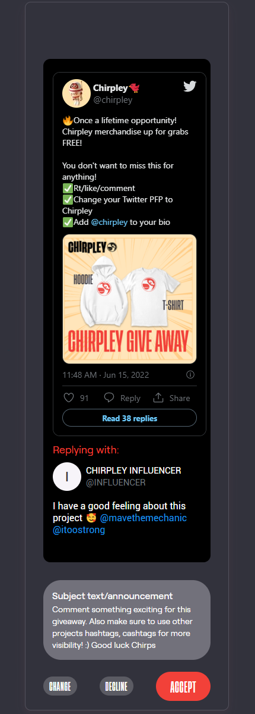
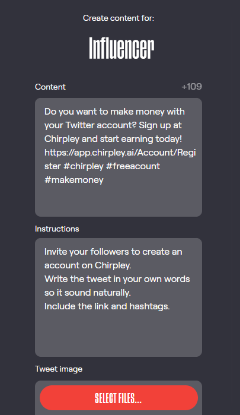
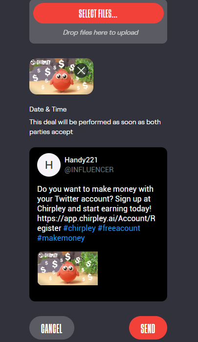

Chirpley as Brand
=====

Chirpley entirely dedicates its marketing platform to small or nano-influencers. It ought to fit these influencers in an extensive campaign. As they say, the magic is not in the number of followers but the number of engagements.

Chirpley revolutionizes the process of influencer marketing. It has been devised to utilize numerous small influencers to improve a campaign’s reach and impact.

Create Campaign
------------

To create a campaign, go to the campaign page (https://app.chirpley.ai/Campaign/CampaignOverview) and click on the "Create New Campaign" button.
This will take you to a new page where you will be presented with a questionary which will guide you through the process.

.. thumbnail::  _static/images/campaign-step1.png
  :width: 500
  :align: center 
  :show_caption: True
  :title:
 
  Set a attractive and recognizable name for your campaign.
  This is the first thing an influencer sees when he/she gets an invite.

.. thumbnail::  _static/images/campaign-step2.png
  :width: 500
  :align: center
  :alt: Campaign Budget
  :show_caption: True
  :title:
  
  Set the budget of your campaign, further up in this form you'll be able to spread this over several services.

.. thumbnail:: _static/images/campaign-step3.png
  :width: 500
  :align: center
  :alt: Campaign Runtime
  :show_caption: True
  :title:
  
  Set the runtime for your campaign, you can set a begin-time and end-time in which your campaign runs, and deals will be performed.
  When choosing ASAP as begin-time, all deal with be executed the moment both parties accept them.

.. thumbnail:: _static/images/campaign-step4.png
  :width: 500
  :align: center  
  :alt: Campaign Location
  :show_caption: True
  :title:
  
  Set the location for your campaign.

.. thumbnail:: _static/images/campaign-step5.png
  :width: 500
  :align: center  
  :alt: Campaign Language
  :show_caption: True
  :title:
  
  Set the language for your campaign.

.. thumbnail:: _static/images/campaign-step6.png
  :width: 500
  :align: center  
  :alt: Campaign Goal
  :show_caption: True
  :title:
  
  What is the goal of your campaign.

.. thumbnail:: _static/images/campaign-step7.png
  :width: 500
  :align: center  
  :alt: Campaign Niches
  :show_caption: True
  :title:
  
  What are niches of your campaign.

.. thumbnail:: _static/images/campaign-step8.png
  :width: 500
  :align: center  
  :alt: Social Media channels
  :show_caption: True
  :title:
  
  Select the social-media channels for your campaign.

.. thumbnail:: _static/images/campaign-step9.png
  :width: 500
  :align: center  
  :alt: Campaign Services
  :show_caption: True
  :title:
  
  Select the services you which for your campaign.

.. thumbnail:: _static/images/campaign-step10.png
  :width: 500
  :align: center  
  :alt: Divide the budget
  :show_caption: True
  :title:
  
  Divide the campaign-budget amongst the chosen services.  

.. thumbnail:: _static/images/campaign-step11.png
  :width: 500
  :align: center  
  :alt: Campaign Niches
  :show_caption: True
  :title:
  
  In the last screen you will be asked to deposit your campaign-budget.

After creating a campaign and successfully deposit your budget it is time to create the deals for the influencers.

.. thumbnail:: _static/images/campaign-step12.png
  :width: 500
  :align: center  
  :alt: Campaign deals
  :show_caption: True
  :title:
  
  Set the content for your new campaign.

Set content and create deals
----------------

For the services you have chosen during the creation of the campaign content needs to be set.

On the left you will find all the services in your campaign. By clicking on them, the service will open in the center of the screen.
In the top of the center-view you can see a selection of filters which you can use to show different type of cards. (Set content, content set etc.)

.. thumbnail:: _static/images/service-header.png
  :width: 600
  :align: center  
  :alt: Service Tabs
  :show_caption: True
  :title:
  
  Deals have different statuses during the runtime of the campaign. By clicking on the filters, deals with that status will be loaded in the grid below.
  
By default, the filter "Set content" is activated.
Until an influencer has accepted a deal, all the shown cards are anonymous except for favorites.

.. thumbnail:: _static/images/cards-anon.png
  :width: 600
  :align: center  
  :alt: Service Tabs
  :show_caption: True
  :title:

  Anonymous cards

To add favorites to a service, just click on the button "Add Favorites".
This will open a pop-up where you can select your personal favorites to be added to the current service.

.. thumbnail::  _static/images/deals-fav.png
  :width: 500
  :align: center
  :alt: Favorites
  :show_caption: True
  :title:
  
  At your personal favorites to the campaign.

The shown cards under "Set Content", "Content Set" and "Invited" represent matching influencers which might perform the services for you.
The number and type of the shown influencers is based on the budget available for that service.
The final number of influencers accepting your deal might vary due to the value of each influencer.

.. thumbnail:: _static/images/deals-like.png
  :width: 600
  :align: center  
  :alt: Like deals
  :show_caption: True
  :title:
  
  View of the like service with 8 selected cards.

Once you select a card in the center of the screen, you'll be able to set the content for these cards in a form on the right side. This can be done one by one or in batch. The questions in the form are related to the service you're working on. 
Below you will find an overview of the questions per service-type.

============  ==========
Service type  Form Items
============  ==========
Like          URL of post to liked.
Follow        URL of profile to be followed.
Retweet       URL of tweet to be shared.
Comment       - URL of tweet to be commented on.

              - content of comment (fix content,change in own-words,write based on instructions).
Tweet         - Content of tweet (fix content,change in own-words,write based on instructions)

              - Media if service is of this type. 
Quote         - URL of tweet to be shared.

              - content of quote (fix content,change in own-words,write based on instructions).
              - Media if service is of this type. 
============  ==========

When you are setting the content for comments, tweets or quotes you can choose between 3 options.

- Influencer cannot change text. (Message should be sent as is)

- Influencer is required to put the text in their own words.

- Influencer writes own content based on text/announcement from brand.

With the first option the brand writes the content, and the influencer has to accept the deal as is.
With the second option, the brand writes the content, but the influencer must rewrite it in their own words and with the final option the brand only gives instructions to the influencer on where to write about, this can be an article, product, event etc.

With the second and third option the brand will be able to review the content written by the influencer. As soon as both parties agree and accept the content the deal is final.

The service-budget will be divided over the different options used in the form. Say you have set 25% of the cards with the first content-option and 75% with the the second,
the budget gets divided between these accordingly. 

Invite Influencers
------------

Once you have set all cards for a particular service, you'll be able to invite all influencers matching this service.
By clicking on the "Send Invite" button in the right-menu, all matching influencers will be invited to perform the selected service.

Because influencers are limited to a fixed number of deals per campaign, we recommend you to first set the content of all services 
and combine the invites of different services (example: like, comment & retweet)
This way the influencer can make a perfect choice on which service they want to perform.

.. thumbnail:: _static/images/deals-invite.png
  :width: 300
  :align: center  
  :alt: Invite matched influencers
  :show_caption: True
  :title:

  Click on the "Send Invite" button to invite the influencers.

After you've sent out the invites, the matching influencers will receive the invitations in their mailbox and as an on-platform notification.
The all the cards have the status "invited"

At this point all you need to do is wait until the budget of the service is filled with accepted deals.

.. thumbnail:: _static/images/deals-progressbar.png
  :width: 300
  :align: center  
  :alt: Service deals-progressbar
  :show_caption: True
  :title:
  
  After sending-out the invites you can see how far the budget for each service is filled. 
  

Review content & Accepting deals
------------

In case the brand has created deals where influencers have to write their own content, the brand will have a chance to review these.
Once an influencer has set the content the deal will be visible under the "Review" tab.
The number in-front of the review-filter shows how many deals need to be reviewed.

Click on the review-filter and all deals which need to be reviewed are shown in the grid below.
Select the deal which you want to review, and the content is shown on the right side.

.. table:: Review Content
   :align: center

   +-------------+-------------+-------------+
   |  |review1|  |  |review2|  |  |review3|  |
   +-------------+-------------+-------------+

At the bottom you can Accept the deal, decline the deal, or change the content. 
When a brand decides to change the content, any changes made to the content need be accepted by the influencer first after which the brand has the final saying.

When both parties agree on the content, the deal is set and will be scheduled for publication.

Chat Function
------------

.. |chaticon| image:: _static/images/chat-icon.svg
   :height: 18px

If a campaign is active you can start a private chat with influencers.
This can be useful when the content requires extra information. Just click on the |chaticon| in the card of the influencer to start a conversation.

.. thumbnail:: _static/images/deals-chat.png
  :width: 300
  :align: center  
  :alt: Cancel Campaign
  :show_caption: True
  :title:
  
  When clicking on the |chaticon| in the deal-cards the chat box opens on the right. 

The chat is only available for influencers with an active status. (accepted,review,pending,completed)
Under the filter "Chat" you can see if influencers have replied or made a new request.

Cancel Campaign
------------

In case a brand made a mistake with the set content of any other reason, he/she can cancel the campaign at any time.

.. thumbnail:: _static/images/cancel-campaign.png
  :width: 300
  :align: center  
  :alt: Cancel Campaign
  :show_caption: True
  :title:
  
  By clicking on the Cancel button in the campaign-overview, the campaign will be cancelled immediately. 

All deals which have not been completed yet will be cancelled that instant and the remaining budget of the campaign reimbursed to the brand's wallet. 

Campaign Dashboard
---------------

N/A

