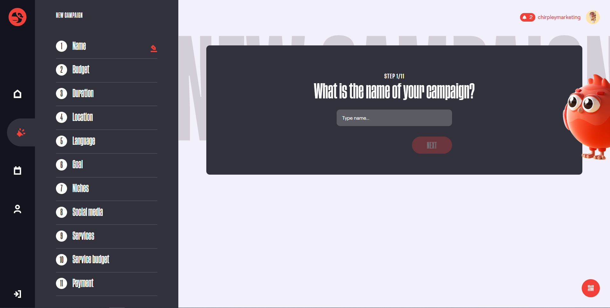

Chirpley as Brand
=====

Chirpley entirely dedicates its marketing platform to small or nano-influencers in the crypto community and blockchain marketing. It ought to fit these influencers in an extensive campaign. As they say, the magic is not in the number of followers but the number of engagements.

Chirpley revolutionizes the process of influencer marketing. It has been devised to utilize numerous small influencers to improve a campaign’s reach and impact.

Create Campaign
------------

To create a campaign go to the campaign page (https://app.chirpley.ai/Campaign/CampaignOverview) and click on the "Creat New Campaign" button.
This will take you to the page as seen below.

Here you will be presented with a questionairy which will guide you through the process.

Set Deals
----------------

After you've send the form, you'll receive a message in your email box (If you can't find it in your imbox, please check your spambox). This includes a link to complete your registration.

.. image:: _static/images/activate.png
  :width: 400
  :align: center  
  :alt: Chirpley Activation

Follow the link and you'll be served with some questions to complete your registration.

Invite Influencers
------------

Fill-in a username of your choice and choose a password.
Passwords must have at least one one digit ('0'-'9') and one non-alphanumeric character.

Pick the Markets where your in active or where your interest lies.

.. image:: _static/images/register.png
  :width: 400
  :align: center  
  :alt: Complete Registration    
 

At the moment of writing and for the purpose of the upcoming pre-sale and launch of our token, we've activated the Crypto market first.
We'll be activating more markets later this year.

Review Content
------------

Before you can make use of the platform as influencer or brand, you'll need to connect at least one social-channel.
At the moment of writing only Twitter is activated, eventually this will change later this year once development progresses.

On the Chirpley-platform you can be brand and influencer at the same time. The switch below your username controls in which role you currently are.
In each role you can connect different social-channels and choose different market-niches.

.. image:: _static/images/profile.png
  :width: 800
  :align: center  
  :alt: Complete Registration 

Click on the Twitter icon and you'll be presented with a questionairy to connect your twitteraccount to your Chirpley-account.

.. |connect1| image:: _static/images/influencer-step1a.png
    :scale: 30%

.. |connect2| image:: _static/images/influencer-step1b.png
    :scale: 30%

.. |connect4| image:: _static/images/influencer-step3.png
    :scale: 30%  

.. |connect5| image:: _static/images/influencer-step4.png
    :scale: 30%

.. |connect6| image:: _static/images/influencer-step5.png
    :scale: 30%

.. |connect7| image:: _static/images/influencer-step6.png
    :scale: 30%     

.. |connect8| image:: _static/images/influencer-step7.png
    :scale: 30% 

.. table:: Connect Twitter
   :align: center

   +------------+------------+------------+------------+
   | |connect1| | |connect2| | |connect3| | |connect4| |
   +------------+------------+------------+------------+
   | |connect5| | |connect6| | |connect7| | |connect8| |
   +------------+------------+------------+------------+
   
Accept Deals
------------

For influencers a twitter-account needs to have a minumum of 100 followers and atleast 20 own tweets.(retweets and replies are excluded) to be able to connect your Twitter)
The moment you've connected your social-media account with the platform, our automated system calculates the value of your account based the content.
In step 6 of the questionairy you'll find the results of this calculation and the pricings your can receive for your selected services.
You're able to adjust these values by 10%.

Cancel Campaign
------------

Twitter-accounts of brands and marketeers aren't limited and the questionairy resembles that of influencers accept for the service and niche part.
These settings are intergrated in the createcampaign-flow.

.. note::

To change these setting in the future you can just click the Social-media icon in your profile (https://app.chirpley.ai/Account/Profile) and edit them thereafter.

Campaign Dashboard
---------------

Please take your time to upload a profile-image in the settings on the right. This will help you get noticed by marketers. 

