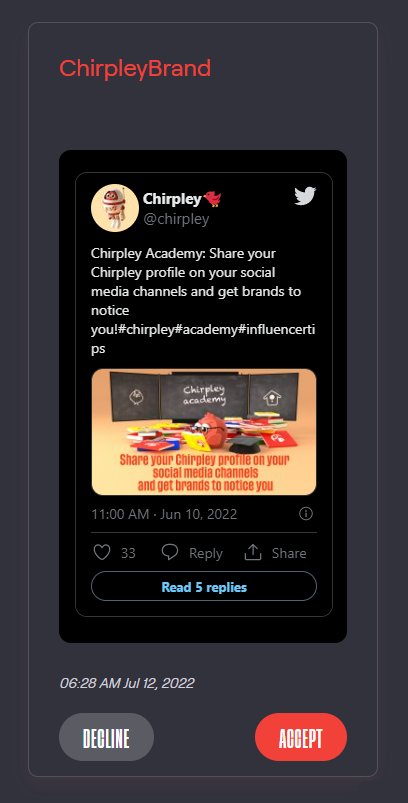
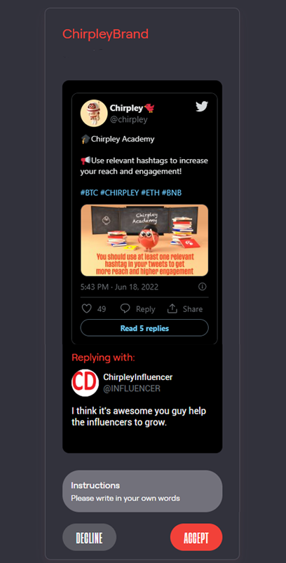
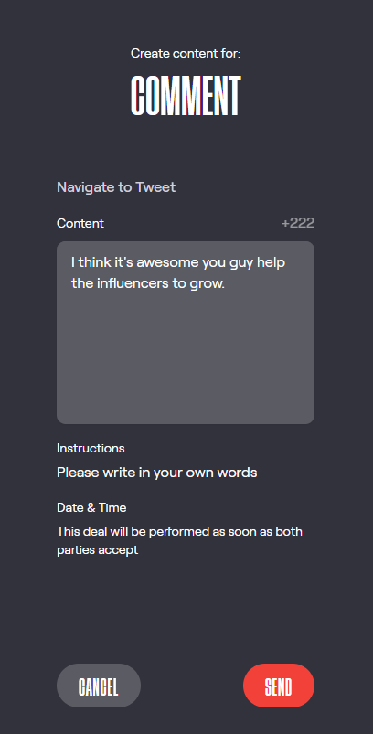

Chirpley as Influencer =====

\_static/images/nano-mega.png

Where one grows, all grow together as a flock.

The Chirpley platform focusses especially on nano and micro-influencers.
We believe the message of many is stronger than the power of one.
Therefor the platform has been developed to be as welcoming as possible,
with an eye for the newborn chicks, and the established influencer as
well.

Where one grows, all grow together as a flock.

# Profile Page

Once you've logged-in on the platform
(<https://app.chirpley.ai/Account/Login>), you can open your
account-page by clicking on the account-icon in the left menu.

\_static/images/influencer-profile.png

Your personal user-profile page

Here you will find some basic information about the connected
social-media channels, your account settings, referral-link and a link
to your public business card.

Public Profile-page ------------

The moment you have connected your socials as an influencer, a public
profile-page is created.

\_static/images/businesscard.png

Your public profile-page with stats.

Here you can show your stats as an influencer and an overview of the
data we have analyzed. At the bottom of your business card, in case we
could gather enough data, you can find detailed information about your
audience.

Be sure to share your public profile-page so you will get noticed by
brands.

Referral Link ------------

We've something called the lifelong referral bonus. How it works: you
will receive a stunning 20% of the Chirpley fees (which is 10% of each
transaction) paid by anyone who creates an account on Chirpley using
your personal referral link.

This means that if you have 5 referees who participate on the same
campaign and each earn $100, you'll receive $10 (20% of their 10% fees)
by doing absolutely nothing.

Your referral link starts with
"<https://app.chirpley.ai/Account/Register?referral=>........" and can
be found on your account-page.

Receiving Invites ------------

To be able to receive invites to campaigns you must have at least 20
followers and have active services in your connected channels.

\_static/images/influencer-step5.png

Active Services

To edit these services and the pricing, just go to your account-page
(<https://app.chirpley.ai/Account/Profile>) and click on your connected
channel (make sure you are in influencer-mode by checking the switch
below your username) in option 5 (just click de red pencil behind it),
you are able to activate the services you wish to provide.

When a brand sends out an invite for a service in their campaign, this
invite is sent to all influencers matching the service and the optional
added favorites.

\_static/images/influencer-invite.png

Influencer Invitation

From this point all invited influencers can accept the presented deal
until the budget of the campaign-service is filled.

It depends on the number available influencers in the selected
market-niche and the available service-budget, how fast an influencer
must react on the invite. We have several systems in-place which
regulate the participation of influencers to have the best outcome for
the brands promotion.

Click on the link in your mailbox to go to the campaign overview.

\_static/images/influencer-campaign-overview.png

Campaign overview within the left column the campaigns to which you are
invited.

Select the campaign with the new deals (recognizable by an alarm-icon
with a positive value). Now the campaign-information and deals are
loaded in the center screen. In the top-section you will find details
about the campaign and the filters for the deals in that campaign.

| Filter type    | Deal Type                                                      |
| -------------- | -------------------------------------------------------------- |
| New Deal       | New deals which you can accept.                                |
| Create Content | Deals which you accepted but still need to create content for. |
| Pending        | Deals which are waiting to be reviewed by the brand.           |
| Review         | Deals which are waiting to be reviewed by you.                 |
| Accepted       | Deals which are accepted and are waiting to be performed.      |
| Declined       | Deals which are declined by you or the brand.                  |
| Completed      | Deals which are completed.                                     |
| Cancelled      | Deals which are cancelled by the brand for any reason.         |
| Chat           | Deals with an active chat-session.                             |

In the bottom grid the deals are displayed along with the type and
price. When selecting a deal, the details are displayed on the right.

# Accepting Deals

Now you can accept or decline the deal opened in the right panel until
the campaign-budget is filled. Once the campaign-budget for this deal is
filled, the window closes, and you won't be able to accept the deal
anymore.

<table style="width:39%;">
<caption>Accept deals</caption>
<colgroup>
<col style="width: 19%" />
<col style="width: 19%" />
</colgroup>
<tbody>
<tr class="odd">
<td><blockquote>

</blockquote></td>
<td><blockquote>

</blockquote></td>
</tr>
</tbody>
</table>

After you have accepted a deal which does not need any further action,
the deal will get the status accepted. Deals that do not need any
further action are: Likes, Retweets, Follows and comments/quotes/tweets
with brand-content.

Setting the Content ----------------

If you've accepted a deal which requires you to write your own content,
the deal will receive the "Set Content" status. By selecting the deal in
de grid, a form opens in the right panel. Here you will see a content
field which might contain text the brand wrote as an example. Below the
text area you will find instructions from the brand on how to alter or
write the content for this deal. Once you have set the content, click on
send.

<table style="width:39%;">
<caption>Set Content</caption>
<colgroup>
<col style="width: 19%" />
<col style="width: 19%" />
</colgroup>
<tbody>
<tr class="odd">
<td><blockquote>

</blockquote></td>
<td><blockquote>

</blockquote></td>
</tr>
</tbody>
</table>

Now the brand will receive a request to review your content where the
brand has 3 options approve, change or decline the content.

  - The brand accepts your proposed content: The deals are set and will
    be scheduled for publication. The deal will have the status
    "accepted" until it is performed.
  - The content is declined by the brand: The deal will be cancelled,
    and no further action is needed. The deal will have the status
    "declined".
  - The brand changes the proposed content: You will receive a request
    to review the changes and accept, change, or cancel the deal. The
    deal will have the status "review".

When both influencer and brand have finally agreed on the content, the
deal will be scheduled for publication.

# Automation

The Chirpley platform is an automated platform. Therefore, when deals
are accepted by both parties, there's no need for any action on either
side. The service agreed on will be scheduled and completed by the
system.

Payment for services ------------

Once a deal is completed and the system has performed the social action,
the payment will be done. In the top panel you can see the amount you
have earned in this particular campaign.

\_static/images/earned-in-campaign.png

Earned in campaign.

Communicate with Brand ------------

If something is unclear about the requested content you can contact the
brand while the deal is not cancelled, declined, or completed. Just
click on the  icon in the
deal-card and a chat-box will open in the right panel.

\_static/images/chat-with-brand.png

Chat with the brand about the deal or content.

