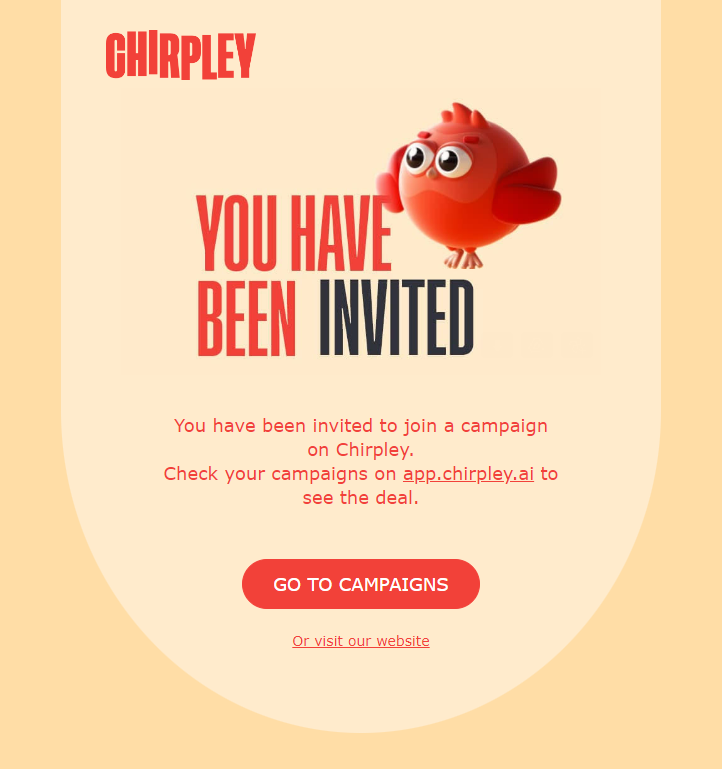
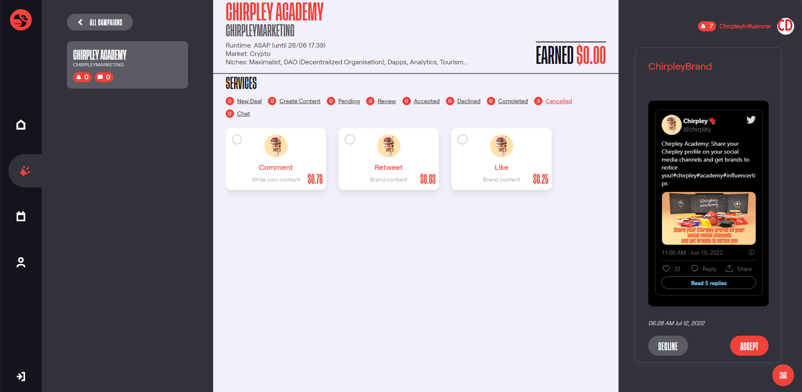

Chirpley as Influencer
=====

.. figure:: _static/images/nano-mega.png
  :width: 800
  :align: center  
  :alt: Nano = Mega

  Where one grows, all grow together as a flock.

The Chirpley platform focusses especially on nano and micro-influencers. We believe the message of many is stronger than the power of one.
Therefor the platform has been developed to be as welcoming as possible, with an eye for the new born chicks, and the established influencer as well.

Where one grows, all grow together as a flock.

Profile Page
------------

Once you've logged-in on the platform (https://app.chirpley.ai/Account/Login) , you can open your account-page by clicking on the account-icon in the left menu.

.. figure:: _static/images/influencer-profile.png
  :width: 600
  :align: center  
  :alt: Cancel Campaign
  
  Your personal user-profile page 

Here you'll find some basic information about the connected social-media channels, your account settings, referral-link and a link to your public business card. 

Public Profile-page
------------

The moment you've connected your socials as an influencer, a public profile-page is created.

.. figure:: _static/images/businesscard.png
  :width: 600
  :align: center  
  :alt: Cancel Campaign
  
  Your public profile-page with stats.  

Here you can show your stats as an influencer and an overview of the data we've analyzed.
At the bottom of your business card, incase we could gather enough data, you can find detailed information about your audience.

Be sure to share your public profile-page so you'll get noticed by brands.

Referral Link
------------

We've something called the lifelong referral bonus.
How it works: you'll receive a stunning 20% of the Chirpley fees (which is 10% of each transaction) paid by anyone who creates an account on Chirpley using your personal referral link.

This means that if you have 5 referees who participate on the same campaign and each earn $100, you'll receive $10 (20% of their 10% fees) by doing absolutely nothing.

Your referral link starts with "https://app.chirpley.ai/Account/Register?referral=........" and can be found on your account-page.

Receiving Invites
------------

To be able to receive invites to campaigns you must have at least 20 followers and have active services in your connected channels.

.. figure:: _static/images/influencer-step5.png
  :width: 400
  :align: center  
  :alt: Active Services

  Active Services

To edit these services and the pricing, just go to your account-page (https://app.chirpley.ai/Account/Profile)
and click on your connected channel (make sure you're in influencer-mode by checking the switch below your username)
in option 5 (just click de red pencil behind it), you're able to activate the services you wish to provide.

When a brand sends out an invite for a service in their campaign, this invite is send to all influencers matching the service and the optional added favorites.

  
  Influencer Invitation

From this point all invited influencers can accept the presented deal until the budget of the campaign-service is filled.

It depends on the number available influencers in the selected market-niche and the available service-budget, how fast an influencer must react on the invite.
We have several systems in-place which regulate the participation of influencers to have the best outcome for the brands promotion. 

Accepting Deals
----------------

Click on the link in your mailbox to go to the campaign overview.

  Campaign overview with in the left column the campaigns to which you are invited.

Select the campaign with the new deals (recognizable by an alarm-icon with a positive value).
Now the campaign-information and deals are loaded in the center screen.
In the top-section you'll find details about the campaign and the filters for the deals in that particular campaign.

==============  ==========
Filter type     Deal Type
==============  ==========
New Deal        New deals which you can accept.
Create Content  Deals which you accepted but still need to create content for.
Pending         Deals which are waiting to be reviewed by the brand. 
Review          Deals which are waiting to be reviewed by you.
Accepted        Deals which are accepted and are waiting to be performed.
Declined        Deals which are declined by you or the brand.
Completed       Deals which are completed. 
Cancelled       Deals which are cancelled by the brand for any reason.
Chat            Deals with an active chat-session.
==============  ==========

In the bottom grid the deals are displayed along with the type and price.
When selecting a deal, the details are displayed on the right.

Set Content for Deals
------------

Now you're able to accept or decline the deal opened in the right pane until the campaign-budget is filled.
Once the campaign-budget for this deal is filled, the window closes and you won't be able to accept the deal anymore.

.. |invite1| figure:: _static/images/influencer-like-deal.png
    :scale: 50%

    Like deal

.. |invite2| figure:: _static/images/influencer-comment-deal.png
    :scale: 50%

    Comment deal

.. |invite3| figure:: _static/images/influencer-set-content.png
    :scale: 50%

    Set Content

.. table:: Influencer deals
   :align: center

   +-------------+-------------+-------------+
   |  |invite1|  |  |invite2|  |  |invite3|  |
   +-------------+-------------+-------------+

 
 

At the moment of writing and for the purpose of the upcoming pre-sale and launch of our token, we've activated the Crypto market first.
We'll be activating more markets later this year.

Communicate with Brand
------------

Before you can make use of the platform as influencer or brand, you'll need to connect at least one social-channel.
All your account-settings as brand of influencer can be set and edited from your profile-page.(https://app.chirpley.ai/Account/Profile)
At the moment of writing only Twitter is activated, eventually this will change later this year once development progresses.

On the Chirpley-platform you can be brand and influencer at the same time. The switch below your username controls in which role you currently are.
In each role you can connect different social-channels and choose different market-niches.

.. figure:: _static/images/profile.png
  :width: 800
  :align: center  
  :alt: Complete Registration 

Click on the Twitter icon and you'll be presented with a questionairy to connect your twitteraccount to your Chirpley-account.

.. |connect1| image:: _static/images/influencer-step1a.png
    :scale: 30%

.. |connect2| image:: _static/images/influencer-step1b.png
    :scale: 30%

.. |connect3| image:: _static/images/influencer-step2.png
    :scale: 30%

.. |connect4| image:: _static/images/influencer-step3.png
    :scale: 30%  

.. |connect5| image:: _static/images/influencer-step4.png
    :scale: 30%

.. |connect6| image:: _static/images/influencer-step5.png
    :scale: 30%

.. |connect7| image:: _static/images/influencer-step6.png
    :scale: 30%     

.. |connect8| image:: _static/images/influencer-step7.png
    :scale: 30% 

.. table:: Connect Twitter
   :align: center

   +------------+------------+------------+------------+
   | |connect1| | |connect2| | |connect3| | |connect4| |
   +------------+------------+------------+------------+
   | |connect5| | |connect6| | |connect7| | |connect8| |
   +------------+------------+------------+------------+

Overview of Campaign
------------

For influencers a twitter-account needs to have a minumum of 100 followers and atleast 20 own tweets.(retweets and replies are excluded) to be able to connect your Twitter)
The moment you've connected your social-media account with the platform, our automated system calculates the value of your account based the content.
In step 6 of the questionairy you'll find the results of this calculation and the pricings your can receive for your selected services.
You're able to adjust these values by 10%.

Tips
------------

Twitter-accounts of brands and marketeers aren't limited and the questionairy resembles that of influencers accept for the service and niche part.
These settings are intergrated in the createcampaign-flow.

.. note::

To change these setting in the future you can just click the Social-media icon in your profile (https://app.chirpley.ai/Account/Profile) and edit them thereafter.

