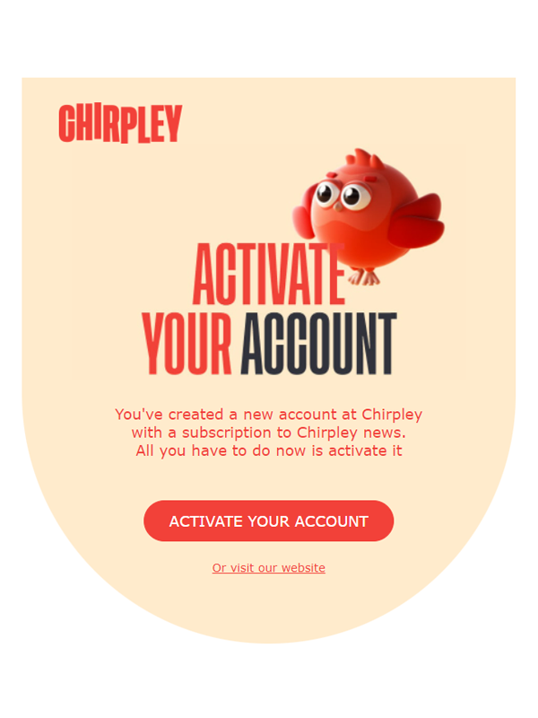
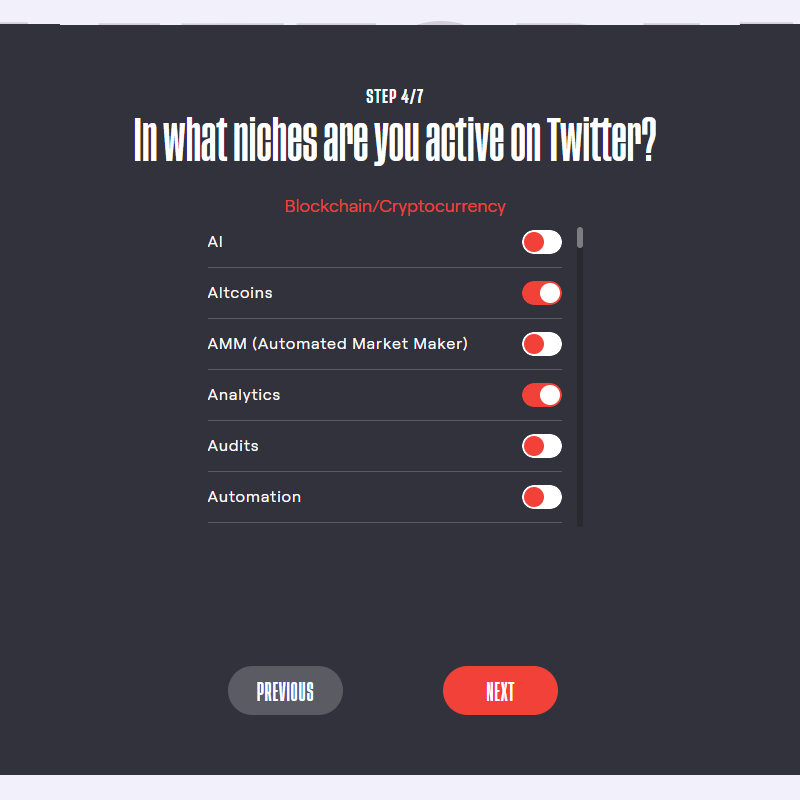

Chirpley as Influencer
=====

.. figure:: _static/images/nano-mega.png
  :width: 800
  :align: center  
  :alt: Nano = Mega

  Where one grows, all grow together as a flock.

The Chirpley platform focusses especially on nano and micro-influencers. We believe the message of many is stronger than the power of one.
Therefor the platform has been developed to be as welcoming as possible, with an eye for the new born chicks, and the established influencer as well.

Where one grows, all grow together as a flock.

Profile Page
------------

Once you've logged-in to your account, you can open your profile page by clicking on the account-icon in the navigation-menu on the left.

  
  Your personal user-profile page 

Here you'll find some basic information about the connected social-media channels, your account settings, referral-link and a link to your public business card. 

Chirpley Business Card
------------

The moment you've connected your socials as an influencer, a personal business card is created.

.. figure:: _static/images/businesscard.png
  :width: 600
  :align: center  
  :alt: Cancel Campaign
  
  Your public business card with stats.  

Here you can see your stats as an influencer and an overview of the data we've analyzed.
At the bottom of your business card, incase we could gather enough data, you can find detailed information about your audience.

Be sure to share your business card so you'll get noticed by brands.

Referral Link
------------

We've something called the lifelong referral bonus.
How it works: you'll receive a stunning 20% of the Chirpley fees (which is 10% of each transaction) paid by anyone who creates a Chirpley account using your personal referral link.

This means that if you have 5 referees who participate on the same campaign and each earn $100, you'll receive $10 (20% of their 10% fees) by doing absolutely nothing.

Your referral link starts with "https://app.chirpley.ai/Account/Register?referral=........" and can be found on your profile-page.

Receiving Invites
------------

To be able to receive invites to campaigns one must have at least 
This is due to strict privacy regulations in some parts of the world.

.. image:: _static/images/signup.png
  :width: 400
  :align: center  
  :alt: Chirpley Sign-up

Just go to https://app.chirpley.ai/Account/Register in your browser of choice and fill in your emailadres and date of birth.
Before you hit the red Register-button you can choose to be updated on news and upcoming features by clicking the check-box.

Accepting Deals
----------------

After you've send the form, you'll receive a message in your email box (If you can't find it in your imbox, please check your spambox). This includes a link to complete your registration.

Follow the link and you'll be served with some questions to complete your registration.

Set Content for Deals
------------

Fill-in a username of your choice and choose a password.
Passwords must have at least one one digit ('0'-'9') and one non-alphanumeric character.

Pick the Markets where your in active or where your interest lies.

.. image:: _static/images/register.png
  :width: 400
  :align: center  
  :alt: Complete Registration    
 

At the moment of writing and for the purpose of the upcoming pre-sale and launch of our token, we've activated the Crypto market first.
We'll be activating more markets later this year.

Communicate with Brand
------------

Before you can make use of the platform as influencer or brand, you'll need to connect at least one social-channel.
All your account-settings as brand of influencer can be set and edited from your profile-page.(https://app.chirpley.ai/Account/Profile)
At the moment of writing only Twitter is activated, eventually this will change later this year once development progresses.

On the Chirpley-platform you can be brand and influencer at the same time. The switch below your username controls in which role you currently are.
In each role you can connect different social-channels and choose different market-niches.

.. image:: _static/images/profile.png
  :width: 800
  :align: center  
  :alt: Complete Registration 

Click on the Twitter icon and you'll be presented with a questionairy to connect your twitteraccount to your Chirpley-account.

.. |connect1| image:: _static/images/influencer-step1a.png
    :scale: 30%

.. |connect2| image:: _static/images/influencer-step1b.png
    :scale: 30%

.. |connect3| image:: _static/images/influencer-step2.png
    :scale: 30%

.. |connect4| image:: _static/images/influencer-step3.png
    :scale: 30%  

.. |connect6| image:: _static/images/influencer-step5.png
    :scale: 30%

.. |connect7| image:: _static/images/influencer-step6.png
    :scale: 30%     

.. |connect8| image:: _static/images/influencer-step7.png
    :scale: 30% 

.. table:: Connect Twitter
   :align: center

   +------------+------------+------------+------------+
   | |connect1| | |connect2| | |connect3| | |connect4| |
   +------------+------------+------------+------------+
   | |connect5| | |connect6| | |connect7| | |connect8| |
   +------------+------------+------------+------------+

Overview of Campaign
------------

For influencers a twitter-account needs to have a minumum of 100 followers and atleast 20 own tweets.(retweets and replies are excluded) to be able to connect your Twitter)
The moment you've connected your social-media account with the platform, our automated system calculates the value of your account based the content.
In step 6 of the questionairy you'll find the results of this calculation and the pricings your can receive for your selected services.
You're able to adjust these values by 10%.

Tips
------------

Twitter-accounts of brands and marketeers aren't limited and the questionairy resembles that of influencers accept for the service and niche part.
These settings are intergrated in the createcampaign-flow.

.. note::

To change these setting in the future you can just click the Social-media icon in your profile (https://app.chirpley.ai/Account/Profile) and edit them thereafter.

