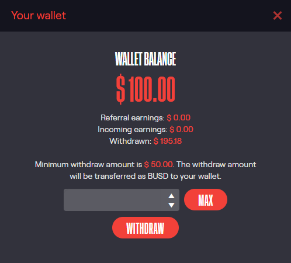
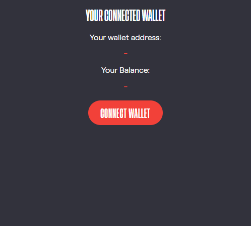
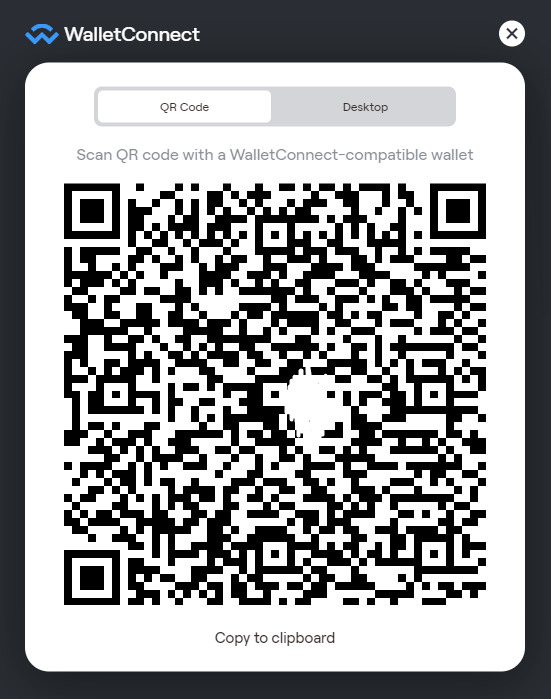

Chirpley Wallet
=====

By clicking on the round button in je bottom-right corner, you can open up your wallet.
Here you'll see an overview of all the financial information concerning your account.

.. table:: Wallet tab with top & bottom part
   :align: center

   +-------------+-------------+
   |  |wallet1|  |  |wallet2|  |
   +-------------+-------------+

In the top part of the wallet you'll find:

- Wallet Balance

- Referral earnings

- Incoming earnings

- Withdrawn ammount

The bottom-part is for connecting your web3 wallet

Connecting External wallet
------------

By connecting your web3 wallet you'll be able to withdraw and deposit funds. At the moment we're only supporting the Binance Smart Chain.
Just click on the "Connect Wallet" button and a pop-up shows with the connection options.

.. figure:: _static/images/connect-wallet.png
  :width: 400
  :align: center  
  :alt: Connect Wallet

  Connect your web3 wallet

Here you can choose between the Metamask browser extension and WalletConnect. (https://walletconnect.com/)
WalletConnect provides you with a QR-code which you can scan with supporting mobile-wallets.

  WalletConnect QR-code

Supporting wallets are:

- Metamask (https://metamask.io/)

- TrustWallet (https://trustwallet.com/)

- Rainbow Wallet (https://rainbow.me/)

- Pillar (https://www.pillar.fi/)

Withdraw
------------

Deposit
------------

Disconnect
------------