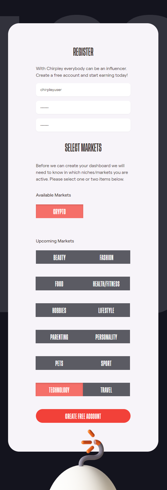
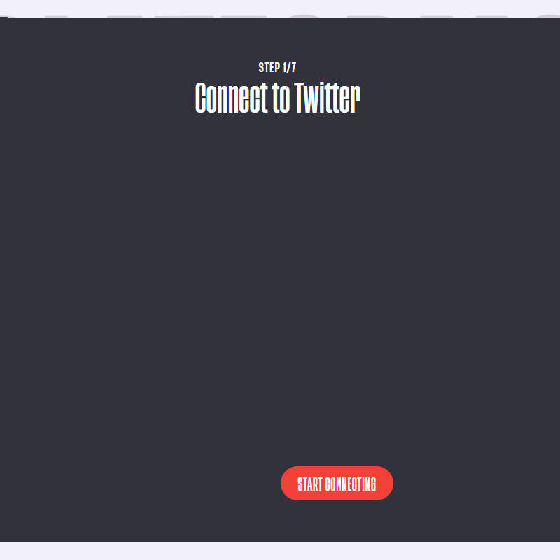
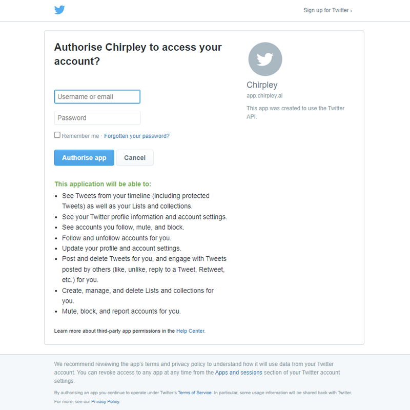
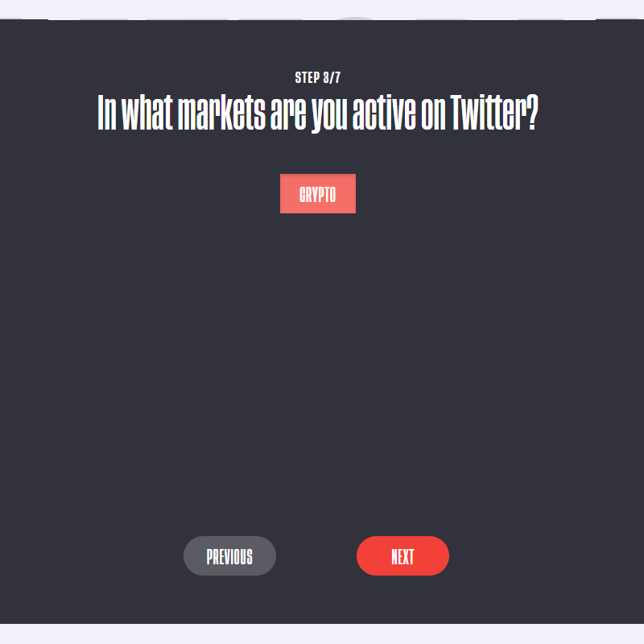
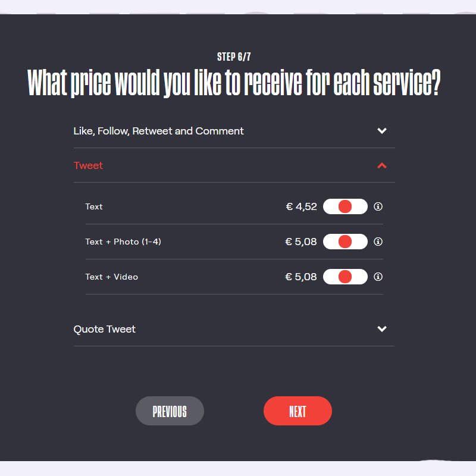
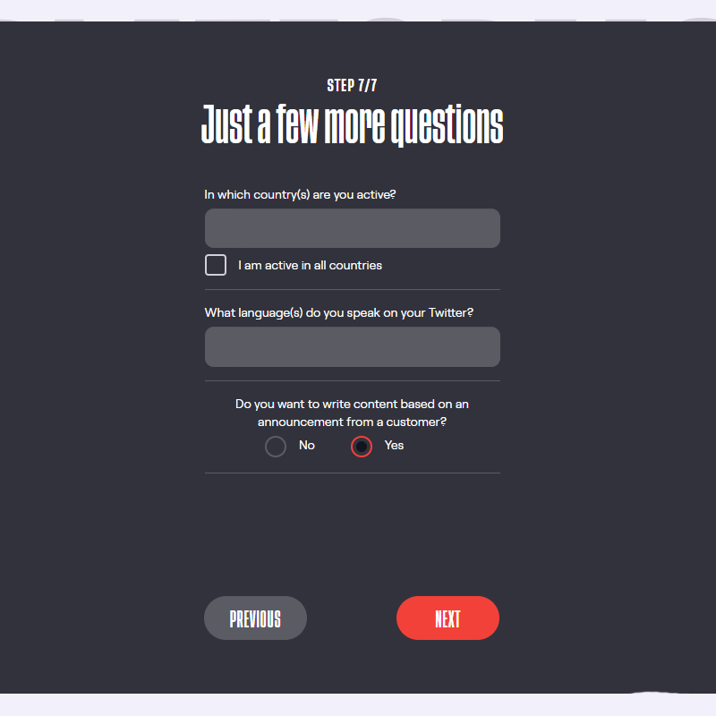

Creating an Account =====

Our platform is designed in such a way that it does not matter if you
are a brand, influencer, content creator or just an average Joe/Jane.
Anyone can register and everyone has the same functionalities at his/her
disposal. You can be a brand and an influencer with the same account,
starting a campaign as a brand and at the same time create content for
other brands just by flipping a switch.

Let me take you down the rabbit hole and introduce you to our
ever-evolving platform.

It all starts with the....

# Registration

To be able to register for an account you will need to be 16yrs or
older. This is due to strict privacy regulations in some parts of the
world.

Just go to <https://app.chirpley.ai/Account/Register> in your browser of
choice and fill in your email-address and date of birth. Before you hit
the red Register-button you can choose to be updated on news and
upcoming features by clicking the checkbox.

# Activation

After you've sent the form, you'll receive a message in your email box
(If you can't find it in your inbox, please check your spam-box). This
includes a link to complete your registration.

Follow the link and you'll be served with some questions to complete
your registration.

# Complete Registration

Fill-in a username of your choice and choose a password. Passwords must
have at least one one digit ('0'-'9') and one non-alphanumeric
character.

Pick the Markets where you are active in or where your interest lies.

At the moment of writing and for the purpose of the upcoming pre-sale
and launch of our token, we've activated the Crypto market first. We
will be activating more markets later this year.

# Setup your Profile

Before you can make use of the platform as influencer or brand, you'll
need to connect at least one social-channel. All your account-settings
as brand of influencer can be set and edited from your profile-page.
(<https://app.chirpley.ai/Account/Profile>) At the moment of writing
only Twitter is activated, eventually this will change later this year
once development progresses.

On the Chirpley-platform you can be brand and influencer at the same
time. The switch below your username controls in which role you
currently are. In each role you can connect different social-channels
and choose different market-niches.

# Connect as Influencer

For influencers a twitter-account needs to have a minimum of 100
followers and at least 20 own tweets. (retweets and replies are
excluded) to be able to connect your Twitter) The moment you have
connected your social-media account with the platform, our automated
system calculates the value of your account based the content. In step 6
of the questionary, you'll find the results of this calculation and the
pricing you can receive for your selected services. You're able to
adjust these values by 10%.

Click on the Twitter icon and you will be presented with a questionary
to connect your Twitter account to your Chirpley-account.

|                                                   |                                                   |                                                  |                                                  |
| ------------------------------------------------- | ------------------------------------------------- | ------------------------------------------------ | ------------------------------------------------ |
|  |  |  |  |
|   |   |  |  |

Connect Twitter

# Connect as Brand

Twitter-accounts of brands and marketeers aren't limited, and the
questionary resembles that of influencers accept for the service and
niche part. These settings are integrated in the create campaign-flow.

Note

To change these setting in the future you can just click the
Social-media icon in your profile
(<https://app.chirpley.ai/Account/Profile>) and edit them thereafter.

# Profile Settings

Please take your time to upload a profile-image in the settings on the
right. This will help you get noticed by marketers.

\_static/images/profile-image.png

Upload your profile image

