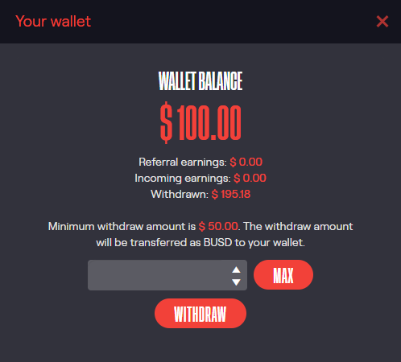
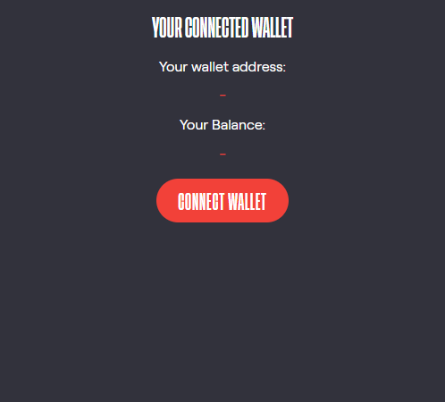

# Chirpley Wallet

By clicking on the round button in je bottom-right corner, you can open
your wallet. Here you will see an overview of all the financial
information concerning your account.

 

In the top part of the wallet, you'll find:

  - Wallet Balance
  - Referral earnings
  - Incoming earnings
  - Withdrawn amount

The bottom-part is for connecting your web3 wallet

## Connecting External wallet

By connecting your web3 wallet you'll be able to withdraw and deposit
funds. At the moment we're only supporting the Binance Smart Chain.
Check this article to add BSC to your wallet
(<https://academy.binance.com/en/articles/connecting-metamask-to-binance-smart-chain>)
Just click on the "Connect Wallet" button and a pop-up shows with the
connection options.

Here you can choose between the Metamask browser extension and
WalletConnect. (<https://walletconnect.com/>) WalletConnect provides you
with a QR-code which you can scan with supporting mobile-wallets.

Supporting wallets are:

  - Metamask (<https://metamask.io/>)
  - TrustWallet (<https://trustwallet.com/>)
  - Rainbow Wallet (<https://rainbow.me/>)
  - Pillar (<https://www.pillar.fi/>)

# Withdraw

You can withdraw your funds anytime of the day. However, the minimum
withdraw amount is 50 USD.

Just make sure your external wallet is connected and fill in the amount
you wish to withdraw. Next click on withdraw and confirm in the popup.

Your funds will be transferred to you in BUSD. To add BUSD to your
Metamask wallet click on 'Add token' and copy-paste the BUSD token
contract address: 0xe9e7CEA3DedcA5984780Bafc599bD69ADd087D56

# Disconnect

To disconnect your external wallet click on the "Disconnect" button. In
case you used the Metamask browser extension, you should disconnect it
from your Metamask wallet.

Open your Metamask wallet and click on "Connected", find the connection,
click the three dots and click on disconnect.
